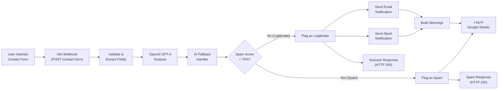

<objective>
Create the architecture diagram (Mermaid) and before/after comparison document with quantified ROI metrics.

Purpose: The architecture diagram (DOCS-02) gives portfolio viewers an instant visual understanding of the system without opening n8n. The before/after comparison (DOCS-05) translates technical automation into business value that Upwork clients care about.

Output: `docs/ARCHITECTURE.md` with Mermaid diagram + component descriptions, `docs/BEFORE-AFTER.md` with metrics table and ROI calculation.
</objective>

<execution_context>
@C:/Users/Eagi/.claude/get-shit-done/workflows/execute-plan.md
@C:/Users/Eagi/.claude/get-shit-done/templates/summary.md
</execution_context>

<context>
@.planning/PROJECT.md
@.planning/ROADMAP.md
@.planning/STATE.md

# Research for diagram and metrics patterns
@.planning/phases/08-documentation-portfolio/08-RESEARCH.md
</context>

<tasks>

<task type="auto">
  <name>Task 1: Create architecture diagram document</name>
  <files>docs/ARCHITECTURE.md</files>
  <action>
Create `docs/` directory and `docs/ARCHITECTURE.md` with:

1. **Title and overview paragraph** explaining the system at a high level (2-3 sentences, non-technical language that Upwork clients understand)

2. **Mermaid flowchart diagram** showing the complete data flow. Use `flowchart LR` (left-to-right) for clear visual flow. Include ALL major components from the actual workflow:



Adjust the diagram to accurately reflect the actual node connections in the workflow JSON.

3. **Component descriptions table** listing each major component, its purpose, and the technology used:

| Component | Technology | Purpose |
|-----------|-----------|---------|
| Contact Form | HTML + Vanilla JS | Collects user inquiries with client-side validation |
| Webhook Trigger | n8n Webhook Node | Receives POST requests with header auth |
| Field Extraction | n8n Set Node | Normalizes form data into consistent structure |
| AI Analysis | OpenAI GPT-4 | Classifies category, generates summary, drafts reply |
| Fallback Handler | n8n Code Node | Injects defaults when OpenAI fails |
| Spam Router | n8n Switch Node | Routes by spam score threshold (>70%) |
| Data Logging | Google Sheets | Persists all submissions with AI analysis |
| Slack Notification | Slack API | Color-coded alert for legitimate submissions |
| Email Notification | SMTP | HTML notification for legitimate submissions |
| Error Tracking | n8n Code Node | Aggregates warnings for partial failures |

4. **Data flow description** — brief paragraph explaining what data flows through the system: form fields in, AI analysis added, routed by spam score, logged with warnings.

5. **Error handling note** — brief explanation that the system degrades gracefully: if OpenAI fails, defaults are used; if Slack/Email fails, submission still logs; user always gets HTTP 200.

Keep the document concise (60-100 lines). No installation instructions here (that's README territory).
  </action>
  <verify>
1. `docs/ARCHITECTURE.md` exists
2. Contains ```mermaid code block
3. Contains component descriptions table
4. `wc -l docs/ARCHITECTURE.md` — at least 30 lines
5. No broken markdown (tables render, headers formatted)
  </verify>
  <done>Architecture document exists with Mermaid flowchart showing all major components, component descriptions table, data flow explanation, and error handling note.</done>
</task>

<task type="auto">
  <name>Task 2: Create before/after comparison document</name>
  <files>docs/BEFORE-AFTER.md</files>
  <action>
Create `docs/BEFORE-AFTER.md` with a structured comparison between manual contact form processing and the automated workflow. Use the metrics and structure from the research document.

Structure:

1. **Title:** "Manual vs Automated: Contact Form Processing"

2. **Executive Summary** (2-3 sentences): This automation replaces a 15-28 minute manual process with a 5-10 second automated pipeline. Key metrics: 99.7% time reduction, 99.8% cost reduction per submission, 400x capacity increase.

3. **Manual Process (Before)** section:
   - Numbered step list (6 steps: receive notification, read and categorize, assess urgency, route to team, log in spreadsheet, draft reply)
   - Time per step (realistic ranges)
   - Total time: 15-28 minutes per submission
   - Pain points: inconsistency, human fatigue, no after-hours coverage, doesn't scale

4. **Automated Process (After)** section:
   - Numbered step list (6 steps matching the manual ones: webhook trigger, OpenAI analysis, spam routing, Google Sheets logging, Slack notification, instant response)
   - Time per step (measured from n8n execution logs)
   - Total time: 5-10 seconds per submission
   - Advantages: consistent, 24/7, scalable, tracks failures

5. **Impact Metrics Table** (the key table from research):

| Metric | Manual Process | Automated Process | Improvement |
|--------|----------------|-------------------|-------------|
| Time per submission | 15-28 minutes | 5-10 seconds | 99.7% reduction |
| Processing capacity | 2-3/hour | 1,000+/day | 400x increase |
| Cost per submission | $7.50-$14.00 (@ $30/hr) | ~$0.03 (OpenAI API) | 99.8% reduction |
| Categorization accuracy | 85-90% | ~95% (GPT-4) | +5-10% improvement |
| Response time | 2-5 minutes | < 5 seconds | 96% faster |
| After-hours coverage | None | 24/7 | Full availability |

6. **ROI Calculation** section:
   - Assumptions stated clearly (hourly rate, submissions per day, OpenAI cost per call)
   - Monthly savings formula: (time saved per submission x submissions/month x hourly rate) - OpenAI API costs
   - Example: At 50 submissions/day, 20 working days/month: saves ~250 hours/month of manual work
   - Annual savings range: $50,000-$100,000 for typical support team

7. **Assumptions & Methodology** section:
   - Manual timing: based on industry averages for email triage + categorization
   - Automated timing: measured from n8n workflow execution logs
   - OpenAI cost: ~$0.03 per GPT-4 classification call
   - Hourly rate: $30/hr blended rate for customer service
   - AI accuracy: based on OpenAI GPT-4 documented classification performance

Keep the document between 80-120 lines. Every claim must have a number attached. No vague "faster" or "better" — only quantified metrics.
  </action>
  <verify>
1. `docs/BEFORE-AFTER.md` exists
2. Contains metrics table with at least 5 rows
3. Contains ROI calculation section
4. Contains assumptions section
5. `wc -l docs/BEFORE-AFTER.md` — at least 60 lines
6. No vague claims without numbers (grep for "much faster", "significant", "greatly" should return 0)
  </verify>
  <done>Before/after document exists with quantified metrics table (6 metrics), ROI calculation with concrete dollar amounts, and documented assumptions. Every claim backed by a number.</done>
</task>

</tasks>

<verification>
1. `docs/` directory exists with 2 files
2. Architecture diagram renders in GitHub markdown (Mermaid block present)
3. Before/after metrics table has 6+ rows with concrete numbers
4. ROI calculation shows annual savings range
5. No vague/unmeasurable claims in before/after document
</verification>

<success_criteria>
- Architecture diagram shows all major system components and data flow
- Before/after comparison quantifies improvements with concrete metrics (time, cost, capacity, accuracy)
- Both documents are concise and portfolio-appropriate (non-technical audience can understand)
- Documents render correctly in GitHub markdown
</success_criteria>

<output>
After completion, create `.planning/phases/08-documentation-portfolio/08-02-SUMMARY.md`
</output>
