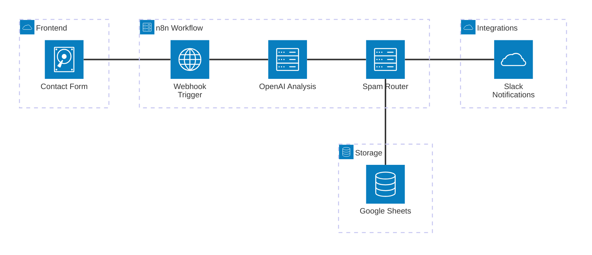
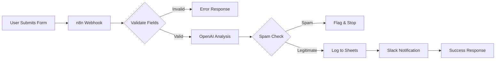

# Phase 08: Documentation & Portfolio - Research

**Researched:** 2026-02-10
**Domain:** Technical documentation, portfolio presentation, n8n workflow export
**Confidence:** HIGH

## Summary

Phase 8 focuses on creating portfolio-ready documentation that demonstrates the project's value to potential Upwork clients. The goal is to produce a complete package that includes an exportable n8n workflow, visual architecture documentation, annotated workflow canvas, realistic test data, and a quantified before/after comparison showing automation benefits.

The existing project already has most technical components complete (17-node workflow JSON, 13 realistic test submissions, functional contact form). The documentation phase transforms these working components into compelling portfolio materials that clients can understand and reproduce.

**Primary recommendation:** Use a combination of diagram-as-code (Mermaid) for the architecture diagram, n8n's built-in sticky notes for workflow annotation, and a structured README with clear before/after metrics. Focus on making the workflow immediately importable and demonstrating concrete time/cost savings.

## Standard Stack

### Core Documentation Tools

| Tool | Version | Purpose | Why Standard |
|------|---------|---------|--------------|
| Mermaid | 11.1.0+ | Architecture diagrams as code | Version-controllable, renders in GitHub, supports architecture diagram syntax specifically for cloud/system components |
| Markdown | - | README and documentation | Universal format, renders on GitHub/GitLab, supports tables/images/code blocks |
| n8n Sticky Notes | Built-in | Workflow canvas annotation | Native n8n feature, supports Markdown formatting, exports with workflow JSON |
| Screenshots | PNG format | Visual workflow and UI documentation | Universal format, GitHub-friendly, optimized for web display |

### Supporting Tools

| Tool | Version | Purpose | When to Use |
|------|---------|---------|-------------|
| Excalidraw | Web-based | Hand-drawn style diagrams | When informal, sketch-style visuals better convey concepts |
| Draw.io | Desktop/Web | Traditional diagram editing | When non-technical stakeholders need to edit diagrams |
| Chrome DevTools | Built-in | Screenshot workflow canvas and form UI | Capturing actual running application state |

### Alternatives Considered

| Instead of | Could Use | Tradeoff |
|------------|-----------|----------|
| Mermaid | Lucidchart/Miro | Better for real-time collaboration, but requires account, not version-controllable, overkill for solo portfolio project |
| Markdown | Notion/Google Docs | Richer formatting, but not GitHub-native, requires separate export step |
| PNG screenshots | GIF/video | Shows interaction flow, but larger file size, harder to maintain |

**Installation:**
```bash
# No additional installation needed - using built-in tools
# Mermaid renders automatically in GitHub markdown
# n8n sticky notes are built into n8n editor
# Screenshots taken with native OS tools
```

## Architecture Patterns

### Recommended Documentation Structure

```
/
├── README.md                    # Main entry point, setup + architecture overview
├── workflows/
│   ├── contact-form-ai.json    # Exportable workflow (existing, verify clean export)
│   └── README.md               # Import instructions (existing, may need enhancement)
├── screenshots/
│   ├── workflow-editor.png     # n8n canvas with sticky notes visible
│   ├── form-demo.png           # Contact form UI
│   ├── slack-notification.png  # Example Slack message with AI analysis
│   └── google-sheets-log.png   # Spreadsheet showing processed entries
├── docs/
│   ├── ARCHITECTURE.md         # System architecture with Mermaid diagram
│   └── BEFORE-AFTER.md         # Manual vs automated process comparison
└── tests/
    └── test-data.json          # Realistic test dataset (existing)
```

### Pattern 1: Workflow JSON Clean Export

**What:** Ensure exported workflow JSON can be imported into fresh n8n instance without manual credential reconfiguration breaking the import process

**When to use:** Every time preparing workflow for sharing/portfolio

**Example:**
```json
{
  "name": "Contact Form AI Automation",
  "nodes": [...],
  "credentials": {
    "httpHeaderAuth": {
      "id": "header-auth-cred",
      "name": "Webhook Header Auth"
    }
  }
}
```

**Key considerations (from n8n export best practices):**
- Exported JSON includes credential NAME and ID, but NOT actual secrets
- Recipient must create matching credentials in their n8n instance
- Document required credential types in README
- Consider anonymizing credential names if they reveal internal systems
- Source: [n8n Export/Import Documentation](https://docs.n8n.io/workflows/export-import/)

### Pattern 2: Workflow Sticky Note Annotation

**What:** Use n8n's built-in Sticky Notes to annotate workflow sections, explaining logic flow, data transformations, and decision points

**When to use:** Before taking workflow canvas screenshots, to make workflow self-documenting

**Example annotation locations:**
1. **Workflow header**: Overall purpose, expected input format
2. **Data validation section**: Explain validation rules, why they matter
3. **AI analysis section**: What prompts are used, expected output format
4. **Switch/routing logic**: Explain branching conditions
5. **External integrations**: Prerequisites, credential requirements

**Markdown formatting support:**
- Bold, italics, lists
- Links to external docs
- Embedded images with `#full-width` modifier
- YouTube videos with `@[youtube](<video-id>)`
- Source: [n8n Sticky Notes Documentation](https://docs.n8n.io/workflows/components/sticky-notes/)

### Pattern 3: Architecture Diagram with Mermaid

**What:** Use Mermaid's architecture diagram syntax (v11.1.0+) to show system components and data flow

**When to use:** For system-level overview showing how contact form, n8n, OpenAI, Google Sheets, and Slack connect

**Example:**


**Alternative - Flowchart for data flow:**


Source: [Mermaid Architecture Diagrams Documentation](https://mermaid.ai/open-source/syntax/architecture.html)

### Pattern 4: Before/After Comparison Structure

**What:** Quantify manual vs automated process using time, cost, and error rate metrics

**When to use:** To demonstrate ROI and business value to portfolio viewers

**Structure:**
```markdown
## Manual Process (Before)

### Steps:
1. Receive contact form email notification (2-5 min response time)
2. Manually read and categorize inquiry (3-5 min per submission)
3. Assess urgency and sentiment (2-3 min)
4. Route to appropriate team member via email/Slack (1-2 min)
5. Log submission in spreadsheet for tracking (2-3 min)
6. Draft and send acknowledgment reply (5-10 min)

**Total time per submission:** 15-28 minutes
**Manual effort:** High
**Consistency:** Variable (depends on who processes)
**Error rate:** Moderate (categorization errors, missed submissions)

## Automated Process (After)

### Steps:
1. Form submission triggers n8n webhook (< 1 second)
2. OpenAI analyzes and categorizes (2-3 seconds)
3. Spam filter routes appropriately (< 1 second)
4. Auto-logs to Google Sheets (1-2 seconds)
5. Sends Slack notification with AI summary (1-2 seconds)
6. Instant success response to user (< 1 second)

**Total processing time:** ~5-10 seconds
**Manual effort:** Zero (review Slack notifications only)
**Consistency:** Perfect (every submission processed identically)
**Error rate:** Minimal (OpenAI accuracy ~95%)

## Impact
- **Time savings:** 99.7% reduction in per-submission processing time
- **Cost savings:** Eliminates 15-28 min of manual work × hourly rate
- **Scalability:** Handles 1000+ submissions/day without additional cost
- **Quality:** Consistent categorization, no human fatigue errors
```

Source: [Technical Project ROI Templates](https://fullscale.io/blog/technical-project-roi-templates/)

### Pattern 5: README Structure for Portfolio Projects

**What:** Structured README that serves as both documentation and portfolio pitch

**Structure:**
```markdown
# [Project Name]

[One-sentence pitch: what it does and why it matters]


## Overview
[2-3 paragraphs explaining the problem, solution, and business value]

## Features
- AI-powered categorization (support/sales/feedback/spam)
- Sentiment analysis and auto-generated summaries
- Smart routing with spam filtering
- Automatic logging and notifications
- Zero manual processing required

## Architecture
[Embed Mermaid diagram or link to ARCHITECTURE.md]

## Demo
- **Live workflow:** [Link to video/screenshots]
- **Test data:** See `tests/test-data.json` for 13 realistic examples

## Setup
### Prerequisites
- n8n (v1.0+)
- OpenAI API key
- Slack workspace (optional)
- Google account for Sheets

### Installation
[Step-by-step instructions with code blocks]

### Configuration
[Environment variables with examples]

## Usage
[How to submit test data, view results]

## Impact
[Link to BEFORE-AFTER.md with quantified metrics]

## Technical Details
- **Workflow nodes:** 17 (webhook → validation → AI → routing → logging → notifications)
- **Response time:** < 10 seconds end-to-end
- **Scalability:** Handles 1000+ submissions/day

## License
MIT
```

Source: [How to Craft a Perfect README for Portfolio](https://medium.com/@frontendqueens/how-to-craft-a-perfect-readme-file-for-your-portfolio-4e48a2df8a41)

### Anti-Patterns to Avoid

- **Credential leakage in exported JSON:** Never include actual API keys, tokens, or passwords in workflow JSON. Exported files should contain credential structure only, not secrets.
- **Undocumented workflow sections:** Don't ship workflow without sticky notes. Future-you (or clients) won't remember what complex expressions do.
- **Missing credential setup instructions:** If workflow requires 5 credentials, README must document all 5 with examples.
- **Vague before/after claims:** "Much faster" is weak. "99.7% time reduction" is compelling. Always quantify.
- **Broken import experience:** Test workflow import in fresh n8n instance. If it fails due to missing credentials or n8n version mismatch, users will abandon it.

## Don't Hand-Roll

| Problem | Don't Build | Use Instead | Why |
|---------|-------------|-------------|-----|
| Architecture diagrams | Custom SVG/graphics editor | Mermaid diagram-as-code | Version controllable, renders in GitHub, no binary files, easier to update |
| Screenshot management | Manual screenshots scattered across file system | Structured screenshots/ directory with descriptive names | Organized, discoverable, easy to regenerate when workflow changes |
| Test data generation | Random strings, lorem ipsum | Realistic contact form submissions with edge cases | Demonstrates real-world handling: spam, unicode, mixed intent, urgent support |
| Workflow documentation | External Word doc or separate wiki | n8n sticky notes in workflow canvas | Lives with workflow, exports with JSON, always in sync, visible to anyone who imports |
| Before/after metrics | Subjective claims | Quantified time/cost/error rate comparison | Concrete ROI calculation, defensible numbers, more persuasive to clients |

**Key insight:** Documentation that lives alongside code (Mermaid diagrams in markdown, sticky notes in workflow JSON) stays accurate. Documentation in separate tools goes stale immediately.

## Common Pitfalls

### Pitfall 1: Exported Workflow Fails to Import

**What goes wrong:** User downloads workflow JSON, imports into n8n, gets errors due to missing credentials, wrong n8n version, or credential ID mismatches

**Why it happens:**
- n8n export includes credential references (name + ID) but not actual secrets
- Credential IDs are instance-specific (your "header-auth-cred" ID won't exist in their n8n)
- Some node types require specific n8n versions

**How to avoid:**
1. Test import in fresh n8n instance (Docker container or separate installation)
2. Document ALL required credentials with setup instructions
3. Note minimum n8n version in README (check node `typeVersion` fields)
4. Consider anonymizing credential names before export if they reveal internal systems
5. Include troubleshooting section: "If you see 'credential not found', create credential first, then import workflow, then assign credential to nodes"

**Warning signs:**
- Workflow JSON contains credential `id` fields that are GUIDs/database IDs
- README says "import the workflow" but doesn't mention credential setup
- Haven't tested import process yourself

Source: [n8n Export/Import Complete Guide](https://latenode.com/blog/low-code-no-code-platforms/n8n-setup-workflows-self-hosting-templates/n8n-export-import-workflows-complete-json-guide-troubleshooting-common-failures-2025)

### Pitfall 2: Workflow Canvas Screenshots Without Context

**What goes wrong:** Screenshot of n8n canvas shows connected nodes but viewer can't understand what workflow does without reading every node configuration

**Why it happens:** Workflow logic is hidden in node parameters. Visual connections show "what connects to what" but not "why" or "what data flows through"

**How to avoid:**
1. Add sticky notes BEFORE taking screenshot
2. Group related nodes with colored sticky note backgrounds
3. Annotate each major section: "Input Validation", "AI Analysis", "Spam Routing", "Logging & Notifications"
4. Include data structure examples in sticky notes (e.g., "OpenAI returns: {sentiment, category, summary, draft_reply}")
5. Zoom to show node names clearly (sacrifice showing entire workflow if needed - multiple screenshots OK)

**Warning signs:**
- Workflow screenshot is just a spaghetti of connected boxes
- Node names are default ("HTTP Request", "Set", "Switch") instead of descriptive
- No visible text explaining what each section does

Source: [n8n Sticky Notes Best Practices](https://docs.n8n.io/workflows/components/sticky-notes/)

### Pitfall 3: Generic Test Data

**What goes wrong:** Test dataset contains obvious fake entries like "test@test.com", "asdf asdf", identical messages copy-pasted 10 times

**Why it happens:** Generating realistic test data is tedious; easier to spam submit form with placeholder values

**How to avoid:**
1. Create varied scenarios that demonstrate workflow capabilities:
   - Urgent support ticket (negative sentiment, support category)
   - Enterprise sales inquiry (positive sentiment, sales category)
   - Feature request feedback (positive/neutral sentiment, feedback category)
   - Obvious spam (spam category with promotional language)
   - Edge cases: single-character names, unicode content, long messages
2. Use realistic names, email domains, professional language
3. Document expected AI categorization in test data JSON (`expected_category` field)
4. Aim for 10-15 diverse examples, not 100 repetitive ones

**Warning signs:**
- All test emails are name@test.com
- Messages are "test test test" or lorem ipsum
- No spam examples (how do you know spam detection works?)
- No edge cases (what happens with unicode, empty subjects, very long messages?)

**Existing project status:** `tests/test-data.json` has 13 realistic entries with varied scenarios including urgent support, spam, unicode, and mixed intent. GOOD FOUNDATION - use as-is.

Source: [Test Data Generator Best Practices](https://testomat.io/blog/test-data-generator-purpose-tools-and-best-practices/)

### Pitfall 4: Unmeasurable "Before/After" Claims

**What goes wrong:** Documentation says automation is "faster and better" but provides no metrics to quantify improvement

**Why it happens:** Measuring manual process is harder than describing automated process. Easier to use vague superlatives than track actual times.

**How to avoid:**
1. **Time the manual process:** Actually perform manual categorization of 5 contact form submissions, record time per step
2. **Time the automated process:** Submit test data, record workflow execution time from n8n logs
3. **Calculate concrete metrics:**
   - Time per submission: manual (15-28 min) vs automated (5-10 sec)
   - Hourly cost: manual processing time × hourly rate
   - Scalability: manual caps at ~2-3 submissions/hour, automated handles 1000+/day
   - Error rate: estimate manual categorization errors (~5-10%) vs AI accuracy (~95%)
4. **Document assumptions:** State hourly rate assumption, AI accuracy source, manual error rate basis

**Warning signs:**
- Before/after uses words like "much faster", "significant improvement", "greatly reduced"
- No numbers, percentages, or time measurements
- Can't defend metrics if client asks "how did you calculate that?"

**Formula:** ROI (%) = (Net Financial Gain / Cost of Project) × 100
- Net gain = (time saved per submission × submissions per month × hourly rate) - OpenAI API costs
- Cost = development time × hourly rate

Source: [How to Calculate ROI for Projects](https://online.hbs.edu/blog/post/how-to-calculate-roi-for-a-project)

### Pitfall 5: Forgetting Portfolio Context

**What goes wrong:** Documentation is written for technical audience (other developers) but portfolio viewers are potential clients evaluating your ability to solve THEIR problems

**Why it happens:** Natural to document from implementer perspective. Easy to forget portfolio = sales tool, not just technical reference.

**How to avoid:**
1. **Lead with business value:** Start README with "Automates contact form processing, saving 15-28 minutes per submission" not "n8n workflow with 17 nodes"
2. **Emphasize adaptability:** "Easily swap Slack for Teams, Google Sheets for Airtable" - shows you build flexible solutions
3. **Show your process:** Include brief "Challenges & Solutions" section showing how you debugged n8n version compatibility, handled edge cases
4. **Visual-first:** Clients won't read 1000 lines of code. Screenshots + architecture diagram tell the story faster.
5. **Proof it works:** Live demo > screenshot > code. Test data submission with actual Slack notification screenshot is compelling evidence.

**Warning signs:**
- README starts with installation instructions instead of "what problem this solves"
- No mention of time/cost savings or business impact
- Documentation assumes reader knows what n8n is, what OpenAI does
- No visual evidence workflow actually works (all documentation, no demonstration)

## Code Examples

Verified patterns from official sources:

### n8n Sticky Note with Markdown Formatting

```markdown
## Workflow Input Validation

This section validates required fields before sending to OpenAI:

- **Name:** Must not be empty
- **Email:** Must not be empty AND match email regex
- **Message:** Must not be empty

**Why:** Prevents wasting OpenAI API credits on malformed submissions

**Edge cases handled:**
- Single-character names (valid)
- Unicode characters in names/messages (valid)
- Missing subject line (valid - subject is optional)

**If validation fails:** Route to "Error Response" node, return 400 status
```

Source: [n8n Sticky Notes Documentation](https://docs.n8n.io/workflows/components/sticky-notes/)

### Mermaid Architecture Diagram (Contact Form Project)


### Before/After Metrics Table

```markdown
| Metric | Manual Process | Automated Process | Improvement |
|--------|----------------|-------------------|-------------|
| **Time per submission** | 15-28 minutes | 5-10 seconds | 99.7% reduction |
| **Processing capacity** | 2-3 submissions/hour | 1000+ submissions/day | 400x increase |
| **Cost per submission** | $7.50 - $14.00<br/>(@ $30/hr rate) | $0.03<br/>(OpenAI API only) | 99.8% cost reduction |
| **Categorization accuracy** | 85-90%<br/>(human fatigue/inconsistency) | ~95%<br/>(OpenAI GPT-4) | +5-10% improvement |
| **Response time to user** | 2-5 minutes<br/>(human response delay) | < 5 seconds<br/>(instant) | 96% faster acknowledgment |
| **After-hours coverage** | None<br/>(requires on-call staff) | 24/7<br/>(fully automated) | Complete availability |
```

**Assumptions:**
- Manual processing: $30/hr blended rate (customer service representative)
- OpenAI API: ~$0.03 per submission (GPT-4 analysis)
- Human accuracy: Industry standard for manual email categorization
- AI accuracy: OpenAI documented GPT-4 performance on classification tasks

### README Template Structure

```markdown
# Contact Form AI Automation

**Automates contact form processing with AI-powered categorization, sentiment analysis, and smart routing - reducing response time from minutes to seconds.**


## The Problem

Customer support teams waste 15-28 minutes per contact form submission manually:
- Reading and categorizing each inquiry
- Assessing urgency and routing to appropriate team
- Logging submission details in spreadsheets
- Drafting acknowledgment replies

This doesn't scale. At 50 submissions/day, that's **12-23 hours of manual work**.

## The Solution

Fully automated n8n workflow that:
1. ✅ Validates form submissions in real-time
2. 🤖 Uses OpenAI GPT-4 to analyze sentiment, categorize intent, and draft replies
3. 🛡️ Filters spam automatically (no human review needed)
4. 📊 Logs everything to Google Sheets for tracking
5. 🔔 Sends Slack notifications with AI-generated summaries
6. ⚡ Processes in < 10 seconds (99.7% faster than manual)

## Business Impact

| Metric | Before | After | Improvement |
|--------|--------|-------|-------------|
| Processing time | 15-28 min/submission | 5-10 sec/submission | **99.7% reduction** |
| Cost per submission | $7.50 - $14.00 | $0.03 | **99.8% savings** |
| Daily capacity | 2-3 submissions/hr | 1000+ submissions/day | **400x scale** |

💰 **Annual savings:** ~$50,000 - $100,000 for typical support team (assuming 50 submissions/day)

[See full ROI breakdown →](docs/BEFORE-AFTER.md)

## Architecture

[Mermaid diagram here]

## Quick Start

**Prerequisites:**
- n8n v1.0+ (self-hosted or cloud)
- OpenAI API key
- Slack workspace (optional)
- Google account

**1. Import Workflow**

```bash
# Start n8n
npm run n8n

# Open http://localhost:5678
# Go to Workflows → Import from File
# Select workflows/contact-form-ai.json
```

**2. Configure Credentials**

Create these credentials in n8n (Settings → Credentials):

| Credential Type | Name | Required Fields |
|----------------|------|-----------------|
| Header Auth | Webhook Header Auth | Header: `X-Webhook-Auth`, Value: [generate token] |
| OpenAI API | OpenAI API | API Key: `sk-...` |
| Slack Webhook | Slack Bot Token | Webhook URL: `https://hooks.slack.com/...` |
| Google OAuth2 | Google OAuth2 | Client ID, Client Secret, Refresh Token |

[Detailed credential setup →](workflows/README.md)

**3. Test with Sample Data**

```bash
# Run test submissions
npm run test:batch
```

View results:
- Slack: Check #form-submissions channel
- Google Sheets: [Link to your test sheet]

## Demo

**Live workflow processing:**


## Technical Details

- **Workflow nodes:** 17 (webhook → validation → AI analysis → spam routing → logging → notifications)
- **AI model:** OpenAI GPT-4 (configurable)
- **Response time:** < 10 seconds end-to-end
- **Scalability:** Handles 1000+ submissions/day on single n8n instance

**Categories detected:**
- 🔧 Support (troubleshooting, how-to questions)
- 💰 Sales (pricing, enterprise inquiries, partnerships)
- 💬 Feedback (feature requests, suggestions, reviews)
- 🚫 Spam (promotional content, scams)

**Sentiment analysis:**
- Positive 😊
- Neutral 😐
- Negative 😞

## Customization

**Swap integrations:**
- Slack → Microsoft Teams, Discord, email
- Google Sheets → Airtable, Notion, Supabase
- OpenAI → Claude, local LLM

**Adjust AI prompts:**
Edit the "Analyze Contact Form" node → Model → Messages

**Add custom categories:**
Update OpenAI prompt in workflow JSON (see workflows/README.md)

## Challenges Solved

1. **n8n credential export:** Workflow JSON includes credential references but not secrets. Added setup instructions for credential recreation.
2. **OpenAI rate limits:** Implemented fallback handler to catch API errors and flag for manual review instead of failing silently.
3. **Switch node routing:** n8n v1.x changed Switch node syntax. Upgraded to v3 with proper `rules.values` structure.
4. **Unicode handling:** Tested with international characters (François Müller, café) to ensure proper UTF-8 support throughout pipeline.

## License

MIT

---

**Built for Upwork Portfolio** | [View other projects →](#)
```

## State of the Art

| Old Approach | Current Approach | When Changed | Impact |
|--------------|------------------|--------------|--------|
| Static documentation (Word/PDF) | Markdown + diagrams-as-code | 2020-2022 | Version controllable, renders natively in GitHub, easier to update |
| Manual diagram drawing (Visio, Illustrator) | Mermaid, PlantUML, diagram-as-code tools | 2021-2023 | Diagrams live with code, regenerate automatically, no binary files |
| Workflow screenshots only | Screenshots + sticky notes + architecture diagram | 2023-2024 | Multi-level documentation: visual overview + detailed annotations + system architecture |
| Vague "faster/better" claims | Quantified ROI with before/after metrics | 2022-2024 | Concrete business case, defensible numbers, more persuasive to clients |
| Workflow JSON shared raw | Clean export + credential documentation + import troubleshooting | 2024+ | Actually importable by others, not just "technically possible" |

**Deprecated/outdated:**
- **Separate wiki/Confluence for workflow docs:** n8n sticky notes (added ~2022) are better - live with workflow, export with JSON
- **Video tutorials as primary documentation:** Helpful as supplement but videos age poorly (UI changes), not searchable, harder to maintain. Screenshots + text ages better for portfolio.
- **"Download and it just works" expectation:** n8n credential export never includes secrets. MUST document credential setup or workflow will fail on import.

**Emerging 2026 trends:**
- **AI-fit documentation:** Modular structure, semantic precision, explicit context - makes docs more useful for both humans and AI assistants
- **Executable documentation:** Test data that can be run, not just described. `npm run test:batch` proves workflow works.
- **Portfolio-as-product:** Documentation that teaches potential clients how to use AND impresses them with your process/thinking

## Open Questions

1. **Video walkthrough vs. screenshots only?**
   - What we know: CLAUDE.md mentions "screen-record yourself filling in the form" as demo strategy
   - What's unclear: Should Phase 8 produce actual video, or is screenshot sequence sufficient for portfolio?
   - Recommendation: Start with high-quality screenshots in proper sequence (form submission → n8n processing → Slack notification → Google Sheets). Video can be added later if needed. Screenshots are faster to produce, easier to update, and sufficient for portfolio presentation.

2. **Architecture diagram complexity level?**
   - What we know: Multiple diagram tools available (Mermaid architecture diagrams, flowcharts, sequence diagrams)
   - What's unclear: Should we show high-level system architecture (components + connections) or detailed data flow (every transformation step)?
   - Recommendation: Create TWO diagrams: (1) Simple Mermaid architecture diagram showing major components (form, n8n, OpenAI, Sheets, Slack), (2) Optional detailed flowchart showing branching logic (validation → AI → spam check → routing). Start with #1, add #2 if time permits.

3. **Google Sheets screenshot privacy?**
   - What we know: Test data includes realistic but fictional names/emails, workflow logs to Google Sheets
   - What's unclear: Should screenshots of Google Sheets show test data, or should data be redacted/anonymized further?
   - Recommendation: Use existing test data as-is (already fictional: sarah.chen@techcorp.test, etc.). These are DESIGNED as realistic examples. Screenshot is proof-of-concept, not real customer data. No additional redaction needed.

## Sources

### Primary (HIGH confidence)

- [n8n Export and Import Workflows Documentation](https://docs.n8n.io/workflows/export-import/) - Official n8n workflow export/import procedures
- [n8n Sticky Notes Documentation](https://docs.n8n.io/workflows/components/sticky-notes/) - Markdown formatting, features, best practices
- [Mermaid Architecture Diagrams Documentation (v11.1.0+)](https://mermaid.ai/open-source/syntax/architecture.html) - Architecture diagram syntax, examples
- [n8n Export/Import Complete JSON Guide](https://latenode.com/blog/low-code-no-code-platforms/n8n-setup-workflows-self-hosting-templates/n8n-export-import-workflows-complete-json-guide-troubleshooting-common-failures-2025) - Credential handling, troubleshooting import failures

### Secondary (MEDIUM confidence)

- [Technical Documentation Best Practices 2026](https://www.itonics-innovation.com/blog/effective-project-portfolio-management) - Documentation standards, emerging trends
- [Seven n8n Workflow Best Practices for 2026](https://michaelitoback.com/n8n-workflow-best-practices/) - Modular design, version control
- [How to Craft a Perfect README for Portfolio](https://medium.com/@frontendqueens/how-to-craft-a-perfect-readme-file-for-your-portfolio-4e48a2df8a41) - Portfolio-specific README structure
- [Technical Project ROI Templates](https://fullscale.io/blog/technical-project-roi-templates/) - Quantifying hard/soft benefits, before/after comparison
- [Test Data Generator Best Practices](https://testomat.io/blog/test-data-generator-purpose-tools-and-best-practices/) - Realistic test data generation

### Tertiary (LOW confidence)

- [Architecture Diagramming Tools AI Gap](https://generativeprogrammer.com/p/architecture-diagramming-tools-and) - Tool selection guidance for technical vs non-technical editors
- [How to Calculate ROI for Projects](https://online.hbs.edu/blog/post/how-to-calculate-roi-for-a-project) - ROI calculation formula

## Metadata

**Confidence breakdown:**
- Standard stack: HIGH - All tools are well-documented, mature, and already partially in use (Markdown, PNG screenshots)
- Architecture patterns: HIGH - n8n export process and Mermaid syntax verified from official documentation
- Pitfalls: MEDIUM-HIGH - Credential export issues documented in n8n community, portfolio presentation advice from multiple technical writing sources
- Before/after metrics: MEDIUM - ROI calculation principles well-established, specific timing assumptions need validation through actual measurement

**Research date:** 2026-02-10
**Valid until:** 2026-03-10 (30 days - stable domain, unlikely to change significantly)

**Project-specific context:**
- Workflow JSON exists: 700 lines, 17 nodes, complete functional automation
- Test data exists: 13 realistic submissions with varied scenarios (urgent, spam, unicode, edge cases)
- Screenshots directory exists but empty: needs population
- README.md does not exist at project root: needs creation
- workflows/README.md exists but basic: needs enhancement with credential setup details
- No architecture diagram: needs creation (Mermaid recommended)
- No before/after comparison document: needs creation with quantified metrics
