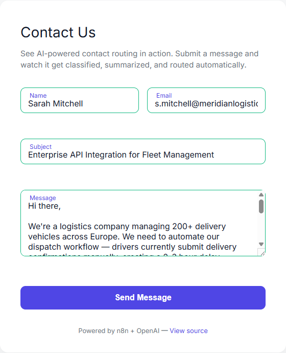
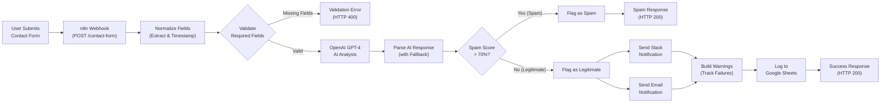
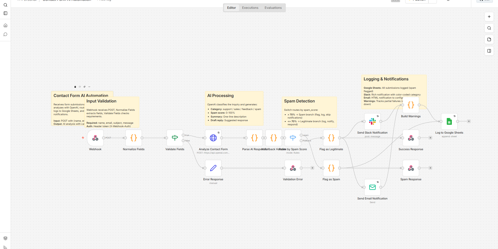
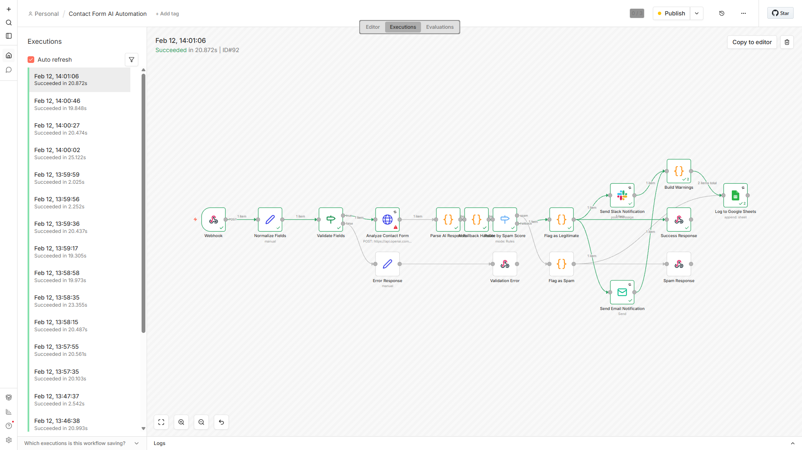

# Contact Form AI Automation

**Automates contact form processing with AI-powered categorization, sentiment analysis, and smart routing — reducing per-submission handling from 15-28 minutes to under 10 seconds.**

## The Problem

Manual contact form processing is repetitive and time-consuming. Every submission requires a staff member to read the message, determine its category (support, sales, feedback, or spam), assess urgency, route to the appropriate team, log it in a spreadsheet, and draft an acknowledgment reply. At 50 submissions per day, this consumes 12-23 hours of valuable human time that could be spent on higher-value work. Submissions outside business hours sit unprocessed until the next day, and categorization quality degrades as staff fatigue sets in.

## The Solution

This n8n automation replaces the entire manual pipeline with an AI-powered workflow that processes submissions in 5-10 seconds. When a user submits the contact form, an n8n webhook receives the data, OpenAI's GPT-4 analyzes the content to classify category and sentiment, a Switch node routes spam submissions away from human attention, and legitimate inquiries are logged to Google Sheets while triggering color-coded Slack notifications and HTML email alerts. The entire process completes before the user finishes reading the success message on screen.



## Business Impact

| Metric | Manual Process | Automated Process | Improvement |
|--------|----------------|-------------------|-------------|
| **Time per submission** | 15-28 minutes | 5-10 seconds | **99.7% reduction** |
| **Processing capacity** | 2-3 submissions/hour | 1,000+ submissions/day | **400x increase** |
| **Cost per submission** | $7.50-$14.00 (@ $30/hr) | ~$0.03 (OpenAI API) | **99.8% reduction** |
| **Categorization accuracy** | 85-90% (human variance) | ~95% (GPT-4) | **+5-10% improvement** |
| **Response time to user** | 2-5 minutes (email check delay) | <5 seconds (instant) | **96% faster** |
| **After-hours coverage** | None (requires on-call staff) | 24/7 (fully automated) | **Full availability** |

[See full ROI breakdown](docs/BEFORE-AFTER.md) including monthly savings calculations ($10,470/month at 50 submissions/day) and break-even analysis (<2 days).

## Architecture



[Detailed architecture documentation](docs/ARCHITECTURE.md)





## Features

- AI-powered categorization (support, sales, feedback, spam)
- Automatic spam filtering (>70% confidence threshold)
- One-line message summaries
- AI-drafted response suggestions
- Google Sheets logging with all submissions tracked
- Color-coded Slack notifications for legitimate inquiries (green=sales, red=support, yellow=feedback)
- Email notifications with HTML formatting
- Graceful error handling (always returns HTTP 200)
- Warnings tracking for partial failures (AI/Slack/Email)
- 24/7 availability with no human intervention

## Quick Start

**Prerequisites:**

- Node.js (version <=24.x, n8n incompatible with Node 25+)
- npm
- OpenAI API key (GPT-4 access required)
- Google account (for Sheets API)
- Slack workspace (optional, for notifications)

**Setup Steps:**

1. Clone the repository
   ```bash
   git clone https://github.com/voyagi/upwork-n8n-automation.git
   cd upwork-n8n-automation
   ```

2. Install dependencies
   ```bash
   npm install
   ```

3. Configure environment variables
   ```bash
   cp .env.example .env
   # Edit .env and fill in required values
   ```

4. Start n8n
   ```bash
   npm run n8n
   # Opens at http://localhost:5678
   ```

5. Import and configure workflow
   - See [workflows/README.md](workflows/README.md) for detailed import instructions
   - Create 4 credential types: Header Auth, OpenAI API, Google Sheets OAuth2, Slack API
   - Assign credentials to appropriate nodes

6. Start the contact form
   ```bash
   npm run dev
   # Opens at http://localhost:3000
   ```

7. Test with sample data
   ```bash
   node tests/batch-submit.js
   # Submits 13 test cases covering all categories and edge cases
   ```

## Test Data

The repository includes a comprehensive test dataset with 13 realistic contact form submissions covering:

- **Support inquiries:** Urgent production issues, how-to questions, minimal input edge cases
- **Sales inquiries:** Enterprise pricing requests, partnership opportunities
- **Feedback submissions:** Feature requests, constructive criticism, long-form research proposals
- **Spam:** Obvious promotional content, crypto scams with emojis and excessive caps
- **Edge cases:** Unicode characters (accented names, emoji flags), single-character names, minimal messages, mixed intent (support + sales)

All test data uses fake but realistic contact information (.test/.local domains) and includes expected category labels for validation. See [tests/test-data.json](tests/test-data.json) and [tests/batch-submit.js](tests/batch-submit.js) for implementation.

## Tech Stack

| Component | Technology |
|-----------|-----------|
| Automation | n8n (self-hosted) |
| AI | OpenAI GPT-4 |
| Form | HTML + Vanilla JS |
| Storage | Google Sheets |
| Notifications | Slack + Email (SMTP) |

## Project Structure

```
public/              Contact form (HTML + CSS + JS)
workflows/           n8n workflow JSON + import guide
tests/               Test data + batch submission script
docs/                Architecture diagram + ROI analysis
screenshots/         Demo screenshots (workflow, form, notifications)
.planning/           GSD execution plans and summaries
```

## Customization

This workflow is designed to be easily adapted for different business needs:

- **Swap Slack for other chat platforms:** Replace Slack node with Microsoft Teams, Discord, or Mattermost webhooks
- **Swap Google Sheets for other databases:** Replace Sheets node with Airtable, Notion, Supabase, or PostgreSQL
- **Swap OpenAI for alternative AI providers:** Replace OpenAI node with Claude (Anthropic), local LLM (Ollama), or other GPT-compatible APIs
- **Adjust spam threshold:** Change Switch node condition from 70% to higher (fewer false positives) or lower (catch more spam)
- **Customize AI prompts:** Modify OpenAI node prompt to include industry-specific categories or change response tone
- **Change notification format:** Edit Slack/Email node templates to match your branding and information hierarchy

All major workflow parameters are configurable through node settings without requiring code changes.

## License

MIT License - see LICENSE file for details.

## Portfolio Project

This automation was built as a portfolio demonstration for Upwork freelancing opportunities. It showcases:

- Integration of third-party APIs (OpenAI, Google Sheets, Slack)
- Workflow automation design patterns (validation, conditional routing, error handling)
- Production-ready practices (authentication, graceful degradation, logging)
- Business value quantification (ROI metrics, time/cost savings)
- Comprehensive documentation (architecture diagrams, setup guides, test data)

For questions or consulting inquiries, see the contact information in the repository profile.
