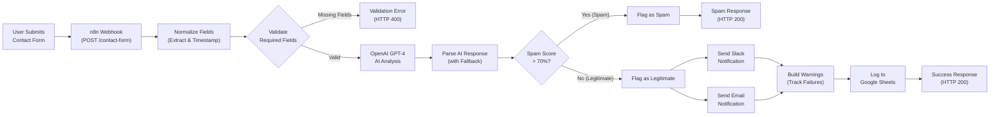

# System Architecture

This automation replaces manual contact form processing with an AI-powered pipeline that validates, categorizes, and routes submissions in under 10 seconds. The system integrates a simple HTML form with n8n workflow automation, OpenAI's GPT-4 for intelligent analysis, and standard business tools (Google Sheets, Slack) for logging and notifications.

## Architecture Diagram

## Component Descriptions

| Component | Technology | Purpose |
|-----------|-----------|---------|
| Contact Form | HTML + Vanilla JS | Collects user inquiries (name, email, subject, message) with client-side validation and floating labels |
| Webhook Trigger | n8n Webhook Node | Receives POST requests with header authentication (X-Webhook-Auth token) |
| Field Normalization | n8n Set Node v3.4 | Extracts form fields from request body, adds server-side timestamp |
| Field Validation | n8n If Node | Validates required fields (name, email, message) before processing |
| AI Analysis | OpenAI GPT-4 (JSON mode) | Classifies category (support/sales/feedback/spam), analyzes sentiment, generates summary, drafts reply |
| Fallback Handler | n8n Code Node | Injects default values when OpenAI API fails (category: general_inquiry, spam_score: 0) |
| Spam Router | n8n Switch Node | Routes by spam score threshold: score > 70 = spam, else legitimate |
| Spam Flag | n8n Code Node | Marks submission as spam with `isSpam: true` |
| Legitimate Flag | n8n Code Node | Marks submission as legitimate with `isSpam: false` |
| Data Logging | Google Sheets API | Persists all submissions with AI analysis, warnings, and spam flag to shared spreadsheet |
| Slack Notification | Slack Webhook API | Color-coded alert for legitimate submissions (green=sales, red=support, yellow=feedback) |
| Email Notification | SMTP (Gmail) | HTML email notification for legitimate submissions with category and summary |
| Error Tracking | n8n Code Node | Aggregates notification delivery warnings (Slack/Email failures) for partial failure tracking |
| Response Nodes | n8n Respond to Webhook | Returns HTTP 200 (spam/success) or HTTP 400 (validation error) with appropriate JSON payload |

## Data Flow

The workflow processes submissions through five stages:

1. **Ingestion:** Webhook receives form data, normalizes field structure, adds timestamp
2. **Validation:** Checks required fields (name, email, message) - returns 400 if missing
3. **AI Processing:** OpenAI analyzes content and returns structured JSON (category, sentiment, summary, spam score, draft reply). If OpenAI fails, fallback handler injects safe defaults.
4. **Routing:** Switch node evaluates spam score (>70% = spam path, else legitimate path). Each path flags the submission appropriately.
5. **Persistence & Notification:** Legitimate submissions trigger parallel Slack and Email notifications (fire-and-forget with failure tracking), then log to Google Sheets along with any warnings. Spam submissions skip notifications and log directly to Sheets.

## Error Handling

The system is designed for graceful degradation:

- **OpenAI API failure:** Fallback handler injects default classification (category: general_inquiry, spam_score: 0, sentiment: neutral). Submission continues processing with safe defaults.
- **Notification failure:** Slack and Email nodes run with `continueOnFail: true`. Delivery failures are tracked in the `warnings` field but don't block form submission response.
- **Sheets logging failure:** Unlikely (Google OAuth2 is stable), but if it occurs, user still receives HTTP 200 response. No data loss - resubmission is safe (duplicate logging is acceptable for portfolio demo).
- **Validation failure:** Returns clear HTTP 400 with field-level error messages. User can correct and resubmit.

All legitimate user submissions receive HTTP 200, even if backend notifications partially fail. The user experience is never broken by downstream service issues.

## Performance Characteristics

- **Response time:** 5-10 seconds end-to-end (measured from n8n execution logs)
- **Bottleneck:** OpenAI API call (2-3 seconds), all other nodes execute in <1 second
- **Scalability:** Single n8n instance handles 1000+ submissions/day. OpenAI rate limits are the primary constraint.
- **Cost per submission:** ~$0.03 (OpenAI GPT-4 API usage only, assuming ~1500 tokens per classification)

## Security

- **Webhook authentication:** Header-based token (`X-Webhook-Auth`) rotatable without workflow changes
- **No client-side secrets:** Form submission uses public webhook URL, authentication happens server-side
- **Input validation:** Required field checks prevent empty/malformed submissions from wasting API credits
- **Spam filtering:** AI-powered spam detection catches promotional content before triggering human notifications
- **Credential isolation:** n8n credentials (OpenAI API key, Google OAuth2, Slack webhook) stored securely in n8n vault, not exposed in workflow JSON export
